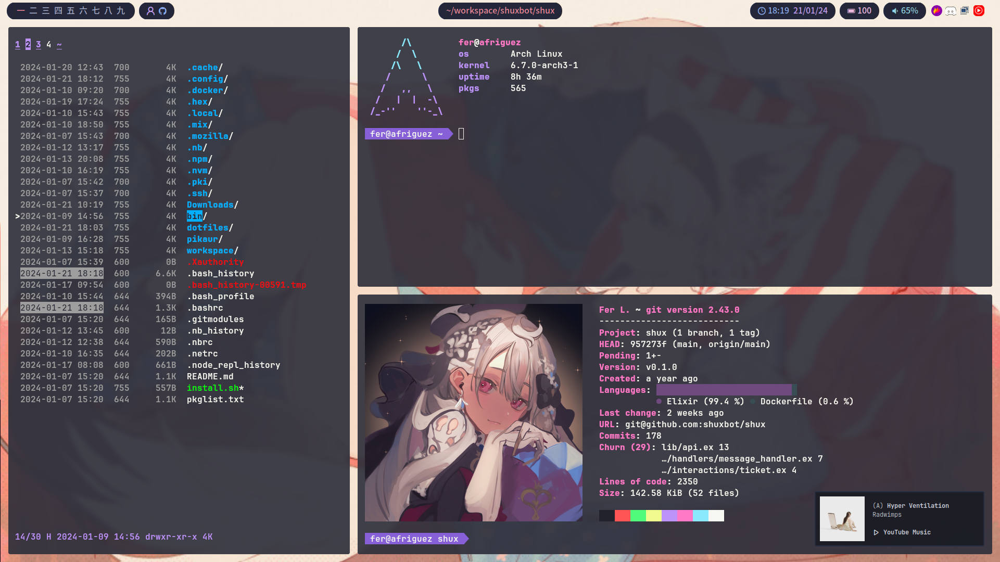
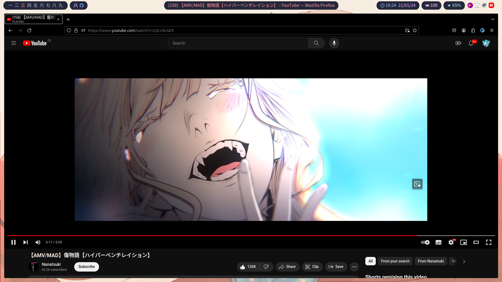

# Dotfiles
|~.~|~.~|
| ------------------------------------ | ------------------------------------ |
|  |  |
|  |  |

## Stuff
|||
| -----------		| ----------- |
| Fonts				| [JetBrainsMono Nerd Font](https://www.programmingfonts.org/#jetbrainsmono) [Noto Sans JP](https://fonts.google.com/noto/specimen/Noto+Sans+JP) |
| Editor			| [nvim](https://neovim.io/) |
| File Manager		| [nnn](https://github.com/jarun/nnn) |
| Terminal Emulator	| [kitty](https://sw.kovidgoyal.net/kitty/) |
| Web Browser		| [chromium](https://www.chromium.org/chromium-projects/) |
| AUR Helper		| yay |
| Window Manager	| [dwm](https://dwm.suckless.org/) |
| Images			| [feh](https://feh.finalrewind.org/)       |
| Audio				| [pulseaudio](https://www.freedesktop.org/wiki/Software/PulseAudio/) - [pavucontrol](https://freedesktop.org/software/pulseaudio/pavucontrol/) -  spotify|
| Notifications		| dunst |

## Maybe
- [x] Remove title
  - with [dwm/notitle](https://dwm.suckless.org/patches/notitle/)
